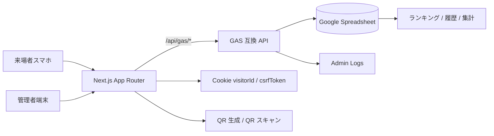

# システムアーキテクチャ図

- フロントエンドは Next.js + TypeScript + TailwindCSS + shadcn 風 UI 部品で構成する。
- バックエンドは GAS を正本とし、Spreadsheet を単一データソースとして扱う。
- ローカル開発では Next.js の route handler が GAS API をエミュレートする。
- 認証は廃止し、visitorId Cookie による識別のみを行う。
- 重要な判定はすべてサーバー側で行い、クライアント側に点数ロジックを持たせない。
