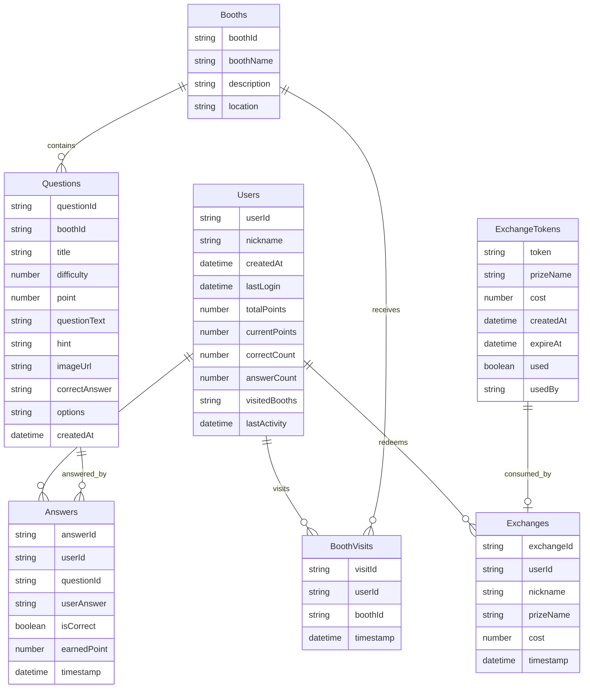

# ER図

```mermaid
erDiagram
  Users ||--o{ Answers : submits
  Users ||--o{ BoothVisits : visits
  Users ||--o{ Exchanges : redeems
  Booths ||--o{ Questions : contains
  Booths ||--o{ BoothVisits : receives
  Questions ||--o{ Answers : answered_by
  ExchangeTokens ||--o| Exchanges : consumed_by
  Users {
    string userId
    string nickname
    datetime createdAt
    datetime lastLogin
    number totalPoints
    number currentPoints
    number correctCount
    number answerCount
    string visitedBooths
    datetime lastActivity
  }
  Booths {
    string boothId
    string boothName
    string description
    string location
  }
  Questions {
    string questionId
    string boothId
    string title
    number difficulty
    number point
    string questionText
    string hint
    string imageUrl
    string correctAnswer
    string options
    datetime createdAt
  }
  Answers {
    string answerId
    string userId
    string questionId
    string userAnswer
    boolean isCorrect
    number earnedPoint
    datetime timestamp
  }
  BoothVisits {
    string visitId
    string userId
    string boothId
    datetime timestamp
  }
  ExchangeTokens {
    string token
    string prizeName
    number cost
    datetime createdAt
    datetime expireAt
    boolean used
    string usedBy
  }
  Exchanges {
    string exchangeId
    string userId
    string nickname
    string prizeName
    number cost
    datetime timestamp
  }
```

- `visitedBooths` は配列ではなく区切り文字列でも運用可能だが、実装では配列として扱い、Spreadsheet では文字列保存に寄せる。
- 回答履歴は全件保存し、正答時のみ加点する。
- 交換はトークン単位で 1 回のみ使用可能にする。
